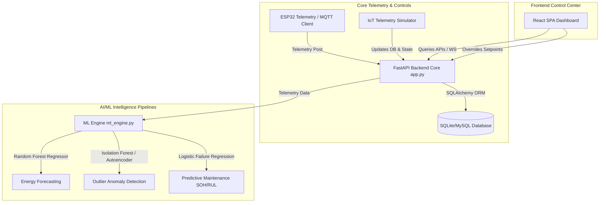

# Smart Hospital Energy Management System (SHEMS) — Technical Documentation

SHEMS is a production-grade, AI-powered Building Energy Management System (BEMS) designed specifically for healthcare environments. It optimizes microgrid electricity routing, HVAC target setpoints, and standby medical equipment idle times in real time without compromising patient safety, clinical comfort, or critical healthcare operations.

---

## 🏛️ System Architecture



### 🔋 Smart Energy Routing Engine
The routing engine operates on a strict priority hierarchy to minimize utility grid draw and maximize renewable solar offsets:

1. **Solar Power:** Runs active loads directly during daylight.
2. **Battery Storage (BESS):** Discharges excess stored solar energy during peak demand/high tariff windows.
3. **Primary Utility Grid:** Runs base loads when renewable offsets are exhausted.
4. **Emergency Generator:** Auto-starts to back up ICU and OT surgical blocks during grid/battery blackouts.

---

## 🧠 Machine Learning Pipelines

SHEMS integrates three core machine learning pipelines built on Scikit-Learn:

### 1. Energy Demand Forecaster (Random Forest Regressor)
- **Features:** `hour_of_day`, `day_of_week`, `occupancy_count`, `outdoor_temperature`.
- **Target:** `total_power_demand_kw`.
- **Logic:** Forecasts load curves over the next 24-hour window, enabling the system to pre-charge batteries before high-load tariffs kick in.

### 2. Anomaly Detection (Isolation Forest)
- **Features:** `total_power`, `grid_import`, `carbon_emitted`.
- **Logic:** Identifies statistical outliers representing abnormal grid spikes (e.g. heating leaks during summer) or line grounding faults.
- **Autoencoder Heatmap:** Maps wing-level draws against reconstruction loss, flagging abnormal draws like unauthorized crypto-mining workloads.

### 3. Predictive Maintenance (Logistic Sigmoid Regression)
- **Features:** Mechanical vibration ($mm/s$), core temperature ($^\circ C$), oil pressure ($PSI$).
- **Sigmoid Failure Probability:**
  $$P(\text{failure}) = \frac{1}{1 + e^{-(\beta_1 \cdot \text{vibration} + \beta_2 \cdot \text{temp} - \beta_3 \cdot \text{oil})}}$$
- **RUL Projection:** Computes Remaining Useful Life (RUL) in days, updating maintenance schedules.

---

## 🔌 API Endpoints Reference

All endpoints are hosted on `http://localhost:5000/api/` and are fully interactive via Swagger Docs at `/docs`.

### 1. Live Telemetry
- **`GET /dashboard/live`**
  - *Returns:* Current live JSON state dictionary containing wings, equipment, renewables, and maintenance indicators.

### 2. HVAC Target Overrides
- **`POST /hvac/override`**
  - *Payload:*
    ```json
    {
      "room": "Research Center",
      "lights": 1,
      "hvac": 1,
      "fan_speed": 1
    }
    ```
  - *Safety Guard:* Throws HTTP 400 Bad Request if overrides target ICU or OT shut-offs.

### 3. Machine Learning Projections
- **`GET /predictions/peak`**
  - *Returns:* Predicted peak load times, demand targets, and load distribution breakdowns.
- **`GET /maintenance/predictive`**
  - *Returns:* Failure probabilities, SOH, RUL, and next service dates for Chillers, HVAC, Generators, UPS, and Solar Inverters.

---

## 🔒 Clinical Safety & Automation Policies

### 🛡️ Clinical Safety Shield (Ventilator Lock)
To guarantee patient safety, the system implements hardcoded override shields at the model layer:
* **ICU & OT Target Locks:** Target temperatures are restricted to safe clinical brackets (ICU: $20^\circ C - 23^\circ C$, OT: $18^\circ C - 22^\circ C$).
* **Remote State Lock:** Remote shut-offs or standby commands are completely blocked for critical life-support assets (Ventilators, Cardiac Monitors, Infusion Pumps).

### 🎛️ Occupancy-Aware Automation Rules
If a non-clinical zone's occupancy drops to $0$ for **10 minutes** (simulated at 30 seconds for evaluation):
- Lights & fans automatically transition to **OFF**.
- HVAC target drifts to **ECO Mode** ($24.5^\circ C$).
- Non-essential draws are disabled (cutting standby leakage).
- *On occupant re-entry, the zone instantly wakes up and restores Comfort Mode.*

---

## 📦 Database Schema (SQLAlchemy Models)

The system utilizes 18 defined tables mapping hospital topology, sensor feeds, and ML predictions:
- **`users`:** Holds credentials, hashes, names, and administrative scopes.
- **`settings`:** Threshold target values, HVAC targets, and automation flags.
- **`energy_readings`:** Historic grid import, solar offsets, and carbon emission records.
- **`equipment`:** Inventory of life-support, diagnostic, and auxiliary assets.
- **`alerts`:** Active climate breaches, mechanical vibrations, or power spikes.

---

## 🚀 Local Installation & Setup

### 1. Setup Python Backend:
1. Navigate to the project folder.
2. Initialize and activate a virtual environment:
   ```bash
   python -m venv venv
   # On Windows:
   venv\Scripts\activate
   ```
3. Install dependencies:
   ```bash
   pip install -r backend/requirements.txt
   ```
4. Start the FastAPI server:
   ```bash
   python backend/app.py
   ```
   *FastAPI server will launch on `http://localhost:5000`.*

### 2. Setup React Frontend:
1. Open a new terminal in the `frontend` folder.
2. Install npm packages:
   ```bash
   npm install
   ```
3. Compile production SPA assets:
   ```bash
   npm run build
   ```
4. Or start the hot-reloading development server:
   ```bash
   npm run dev
   ```
   *React dev server will launch on `http://localhost:5173`.*

---

## 📡 MQTT Telemetry Broadcast Details
* **Telemetry Broadcast:** `hospital/bems/telemetry/live` (publishes the full JSON sensor dict every 3s)
* **Critical Alerts Broadcast:** `hospital/bems/alerts/live` (publishes warning message logs)
* **Incoming Commands Topic:** `hospital/bems/controls/+` (listens to remote sensor overrides)
